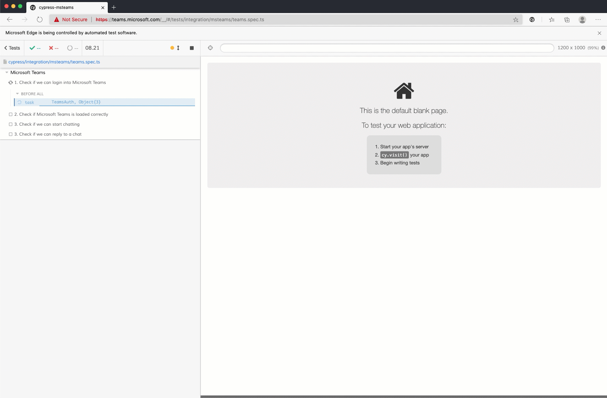

# Cypress sample to E2E test your Microsoft Teams solutions

## How to start

In order to start using this project. You will have to do the following steps:

1. Clone the project
2. `npm i` - Install all the dependencies
3. Rename `cypress.sample.json` to `cypress.json`
4. Provide the `username`, `password`
5. Run `npm test`

## More information

For more information you can check out the following article: [https://www.eliostruyf.com/e2e-testing-microsoft-teams-solutions-cypress/](End-to-End testing your Microsoft Teams solutions with Cypress).